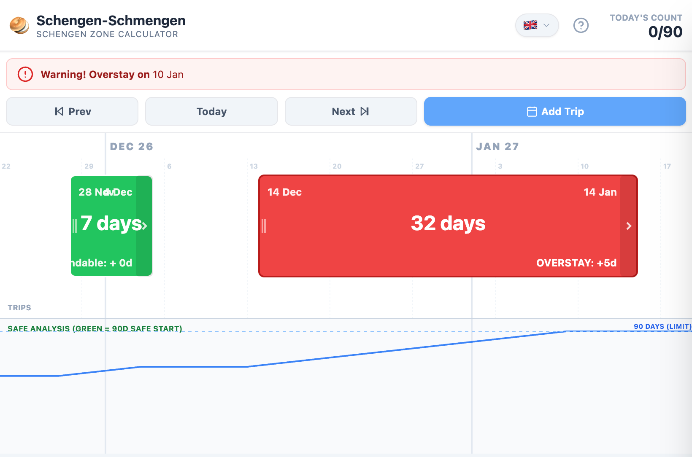

# Schengen-Schmengen 🥯

A completely vibed project. Schengen-Schmengen is a visual Schengen Area 90/180 visa calculator featuring a drag-and-drop timeline, real-time rolling window analysis, and "Safe Start" zones to prevent overstays. Built as an installable PWA with full localization in 7 languages (including Yiddish).

**Live Site:** [https://schmengen.static.domains/](https://schmengen.static.domains/)



## Features

* **Visual Timeline:** See your trips on a continuous scrolling timeline rather than a text list.
* **Rolling Window Logic:** Automatically calculates your 90-day allowance based on the strict 180-day rolling window rule.
* **Safe Start Analysis:** The green lane at the bottom highlights exactly when you can legally re-enter the Schengen zone for a full 90-day trip.
* **Installable PWA:** Built as a Progressive Web App, so it can be installed to your home screen / desktop and launched like a native app.
* **Multi-Language:** Fully translated into English, Spanish, French, German, Russian, Chinese, and a special **Yiddish** mode (pick the 🥯 Bagel from the language menu in the top bar).

## How to Use

### Interaction Basics
* **Add Trip:** Double-tap on an empty space in the top timeline lane.
* **Delete Trip:** Double-tap on an existing trip block.
* **Move Trip:** Drag the body of a trip to shift dates.
* **Resize Trip:** Drag the right edge of a trip to extend or shorten the duration.
* **Check Tool:** Tap or drag anywhere on the timeline to bring up the green analysis line. This simulates "Today" being that specific date to check your past usage and future allowance.

### Color Legend
* 🟩 **Green Block:** Safe Trip (Compliant).
* 🟥 **Red Block:** Overstay Risk (>90 days in the window).
* 🟢 **Green Lane (Bottom):** Safe Start Zone. If a date is covered in green here, you can start a full 90-day trip on this day without violating the rule.

## Understanding the Rules

### The 90/180 Rule
The Schengen Visa rule states you can stay a maximum of **90 days** in any **180-day period**.

### It is a Rolling Window
To check if "today" is legal, border authorities look at the **previous 179 days + today**. If the total days spent in the Schengen zone during that specific window exceeds 90, you are overstaying.

## Disclaimer
This tool is for estimation purposes only. Calculations may vary based on specific border interpretations, timezones, or manual entry errors. You should always verify your status with the [Official EU Visa Calculator](https://ec.europa.eu/assets/home/visa-calculator/calculator.htm) before traveling.

## Development

Built with React 18, Tailwind CSS, and Vite. The core 90/180 date logic lives in `src/schengen.js` and is covered by a Vitest suite.

```bash
npm install      # install dependencies
npm run dev      # start the Vite dev server
npm run build    # produce a production build in dist/
npm run preview  # preview the production build locally
npm test         # run the test suite (runs under TZ=UTC)
```

---
*Built with React, Tailwind CSS, and Vite. Ships as an installable PWA.*
